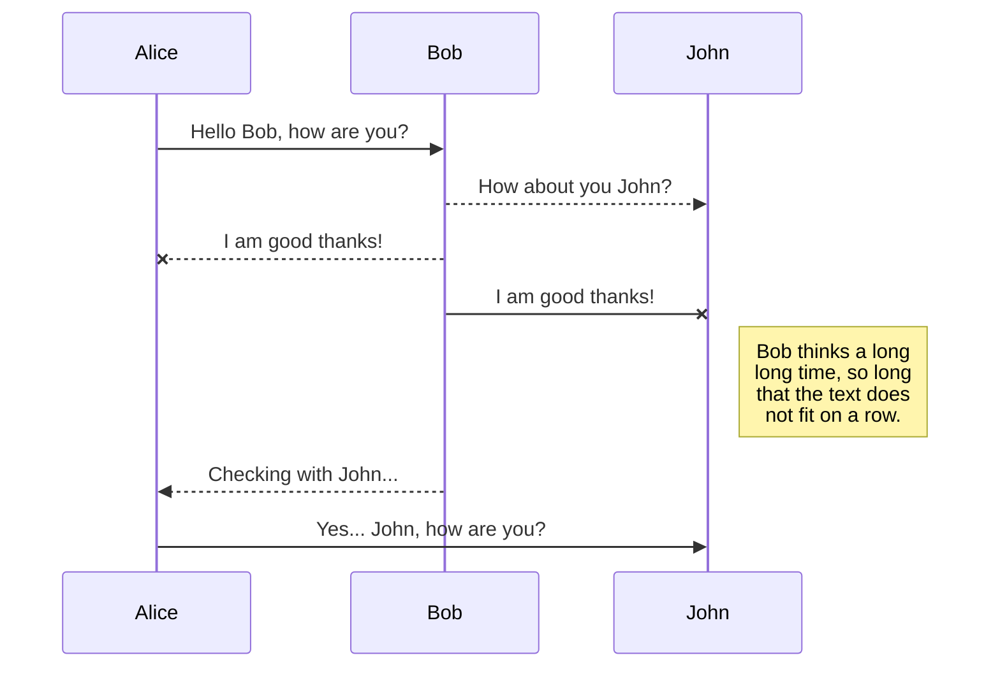
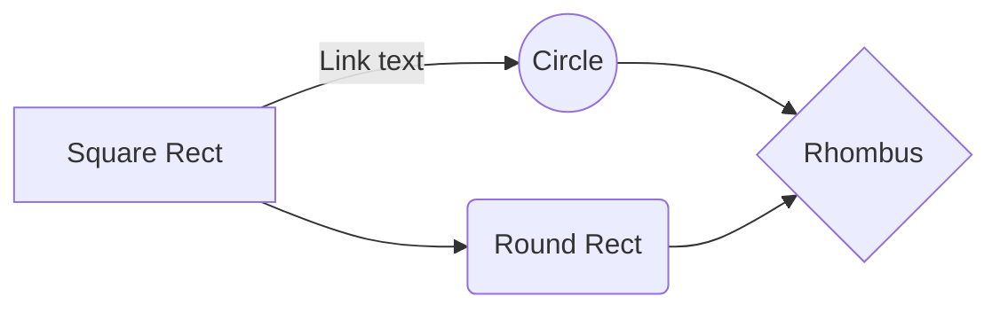

```
github 引入了 markdown 并对之进行拓展，这种由 github 衍生出来的 markdown 称为 GFM(Github Flavored Markdown)。

Markdown 不是想要取代 HTML，甚至也没有要和它相近，它的语法种类很少，只对应 HTML 标记的一小部分。Markdown 的构想不是要使得 HTML 文档更容易书写。在我看来， HTML 已经很容易写了。Markdown 的理念是，能让文档更容易读、写和随意改。HTML 是一种发布的格式，Markdown 是一种书写的格式。就这样，Markdown 的格式语法只涵盖纯文本可以涵盖的范围。

—— John Gruber
```

# Table of Contents【目录】见首行尾行
[TOC]

# ATX 标题
一级标题Github Flavored Markdown
==

二级标题A
--

### B
#### C
##### D
###### E
####### f

setext 标题 1 级标题下划线
=========

setext 标题 2 级标题下划线
---------

# 文本行
即一行文字，markdown 中换行必须进行手动操作（两个空格加换行符），自动换行将会变成一个空格  
> aaaaa 后无空格

aaaaa
bbbbb  
> aaaaa 后两个空格

aaaaa  
bbbbb

# 段落
由数行文字成一段，markdown 中由空行划分段落  
> aaaaa、bbbbb 后面都接两个空格，因此会换行，但它们都是同一段落，或使用反斜杠

aaaaa  
bbbbb  
ccccc

> aaaaa、bbbbb、ccccc 之间都间隔空行，因此划分为三段

aaaaa

bbbbb

ccccc

# 段落和换行
列表项目可以包含多个段落，每个项目下的段落都必须缩进 4 个空格或是 1 个制表符，通过在文本行之间留一个空白行，可创建新段落。  
大多数的编辑器会忽略单行，为了让其它的`Markdown`编辑器识别你的换行符，可以在行尾留下两个空格或者插入`<br/>`标签。  
1.  This is a list item with two paragraphs.  
    The second paragraph.
2.  Suspendisse id sem consectetuer libero luctus adipiscing.

# 文本样式
常规  
**强调1**	__强调2__  
*斜体1*	_斜体2_  
~~删除线~~  
<u>下划线</u>  
下标 θ~1~ 上标 θ^1^ 上^下^~标~  
`<!--注释-->`  
<kbd>方框</kbd>  
<span style="color:red">this text is red</span>  
<font face="黑体" color=red size=5>这是红色黑体5号字</font>  
++Inserted text++  
==Marked text==  
\<mark>  

# 列表
- 无序列表  
    + item
    * item
         + [x] 任务列表  
         - [ ] 列表缩进 Tab
3. 有序列表

4. context

    5. item2
    
    6) item3

        hello段落嵌套
    
      > world引用嵌套
    
    7. item4
    
    8) item5

# 引用
> 文本引用
> > * Quoted text1  
         > 1. Quoted text2  
         >
> > > 多层级

# 代码
行内代码`System out println("Hello World");`  
如果要在代码区段内插入反引号，你可以用多个反引号来开启和结束代码区段  
使用转义反引号  
``There is a literal backtick (`) here.``

```java
代码块1
System out println("Hello World");
```

~~~java
代码块2
System out println("Hello World");
~~~

Indented code

    // Some comments
    line 1 of code
    line 2 of code
    line 3 of code

GFM 中还可以显示 diff 效果，即展示一个文件内容的增加与删除。绿色表示新增，红色表示删除。在三个反引号后面加上 diff 标识符，并且其代码块行头以 + 开头表示新增，- 开头表示删除。
```diff
+ 新增的内容
- 删除的内容
```
# 公式

内联公式  

$$
\begin{aligned}
f(x) &=(m+n)^2 \\
&=m^2+2m+n^2 \end{aligned}
$$

------
分割线三种表示
***
三种符号都可实现-_*
___

If
$$(a \ne 0)$$
the result of
$$(ax^2 + bx + c = 0)$$
are
$$x = {-b \pm \sqrt{b^2-4ac} \over 2a}$$

公式块 csM

$$
\mathbf{V}_1 \times \mathbf{V}_2 =
\begin{vmatrix}
\mathrm{i} & \mathrm{j} & \mathrm{k} \\
\frac{\partial X}{\partial u} &  \frac{\partial Y}{\partial u} & 0 \\
\frac{\partial X}{\partial v} &  \frac{\partial Y}{\partial v} & 0 \\
\end{vmatrix}
$$

# 链接
锚点：每一个标题都是一个锚点，也可以用`HTML`方式定义锚点，需要注意以下问题：
- 标题中的英文字母都要被转化为小写字母
- 空格换成`-`
- 去除括号等`HTML`字符
- 标题名相同时，第2个锚点引用时加后缀，如`标题-2`
- GFM锚点也支持中文  

超链接  

[foo]: /url "title"
[foo]  
__*[百度跳转链接 baidu.com](https://www.baidu.com "附带链接说明")*__ - 加粗斜体的高亮效果  
提示：链接文本不必一定是文本。图片或其他`HTML`元素都可以成为链接。  
[跳转到样式](# 样式)  
链接引用【也适用于图片】`在任意位置定义URL`    
This is an [example][45] reference-style link.  

[45]: https://www.baidu.com  "链接引用"  

## URL
支持自动从标准`URL`创建链接\
https://www.bilibili.com  
Email样式<i@typora.io>

## 图片


# 表格
| Column1  |       Column2 | Column3      | Column4      | \|的表示方法 |
| :------: | ------------: | :----------- | ------------ | :----------: |
| centered | right-aligned | left-aligned | \|竖线内容\| |    &#124;    |

# Emoji
@octocat :+1: This PR looks great  
:clown_face:  
:fire::fire::fire:

# 脚注
You can [^create] footnotes like this [^footnote].  

[^footnote]: Here is the *text* of the **footnote**.
[^create]: create

Footnote 1 link[^first].

Footnote 2 link[^second].

Inline footnote^[Text of inline footnote] definition.

Duplicated footnote reference[^second].

[^first]: Footnote **can have markup** and multiple paragraphs.

[^second]: Footnote text.

# UML diagrams
[创建关系图](https://docs.github.com/en/get-started/writing-on-github/working-with-advanced-formatting/creating-diagrams)






```geojson
{
  "type": "FeatureCollection",
  "features": [
    {
      "type": "Feature",
      "id": 1,
      "properties": {
        "ID": 0
      },
      "geometry": {
        "type": "Polygon",
        "coordinates": [
          [
              [-90,35],
              [-90,30],
              [-85,30],
              [-85,35],
              [-90,35]
          ]
        ]
      }
    }
  ]
}
```

```topojson
{
  "type": "Topology",
  "transform": {
    "scale": [0.0005000500050005, 0.00010001000100010001],
    "translate": [100, 0]
  },
  "objects": {
    "example": {
      "type": "GeometryCollection",
      "geometries": [
        {
          "type": "Point",
          "properties": {"prop0": "value0"},
          "coordinates": [4000, 5000]
        },
        {
          "type": "LineString",
          "properties": {"prop0": "value0", "prop1": 0},
          "arcs": [0]
        },
        {
          "type": "Polygon",
          "properties": {"prop0": "value0",
            "prop1": {"this": "that"}
          },
          "arcs": [[1]]
        }
      ]
    }
  },
  "arcs": [[[4000, 0], [1999, 9999], [2000, -9999], [2000, 9999]],[[0, 0], [0, 9999], [2000, 0], [0, -9999], [-2000, 0]]]
}
```

```stl
solid cube_corner
  facet normal 0.0 -1.0 0.0
    outer loop
      vertex 0.0 0.0 0.0
      vertex 1.0 0.0 0.0
      vertex 0.0 0.0 1.0
    endloop
  endfacet
  facet normal 0.0 0.0 -1.0
    outer loop
      vertex 0.0 0.0 0.0
      vertex 0.0 1.0 0.0
      vertex 1.0 0.0 0.0
    endloop
  endfacet
  facet normal -1.0 0.0 0.0
    outer loop
      vertex 0.0 0.0 0.0
      vertex 0.0 0.0 1.0
      vertex 0.0 1.0 0.0
    endloop
  endfacet
  facet normal 0.577 0.577 0.577
    outer loop
      vertex 1.0 0.0 0.0
      vertex 0.0 1.0 0.0
      vertex 0.0 0.0 1.0
    endloop
  endfacet
endsolid
```

# 转义字符语法
* Without the backslash, this would be a bullet in an unordered list.  
\* Without the backslash, this would be a bullet in an unordered list.

[转义字符文档][转义字符文档]链接列出的字符都可以通过使用反斜杠字符从而达到转义目的。

[转义字符文档]: https://markdown.com.cn/basic-syntax/escaping-characters.html  "链接引用"  

# 部分`HTML`语法
## note标签

<div class="note [class] [no-icon]"><p>content</p></div>

[class]   : default | primary | success | info | warning | danger.  
[no-icon] : Disable icon in note.

## 文本背景色

<form>
    <table>
        <tr>
            <td style="background-color: yellow">Background Color</td>
        </tr>
    </table>
</form>

## 对齐方式
<form>
    <p align="center">居中</p>
    <p align="left">左对齐</p>
    <p align="right">右对齐</p>
</form>

## 复选框 (Checkboxes)
<form>
    <label> 
        <input type="checkbox" name="vehicle" value="Bike" checked /> I have a bike<br />
        <input type="checkbox" name="vehicle" value="Car" /> I have a car
    </label>
</form>

## 表格
<table width="300" border="1" style="text-align:left;">
<caption>title</caption>
<!--border 定义边框-->
<!--text-align:对齐方式 left|right|center-->
    <tr>
        <th>header 1</th>
        <th>header 2</th>
    </tr>
    <tr>
        <td>row1,col1</td>
        <td>row1,col2</td>
    </tr>
    <tr>
        <td>row2,col1</td>
        <td>row2,col2</td>
    </tr>    
</table>

------

<!--合并单元格-->

<table border="1">
<tr>
  <th>Name</th>
  <th colspan="2">Telephone</th>
</tr>
<tr>
  <td>Bill Gates</td>
  <td>911</td>
  <td>110</td>
</tr>
</table>

<table border="1">
<tr>
  <th>First Name:</th>
  <td>Bill Gates</td>
</tr>
<tr>
  <th rowspan="2">Telephone:</th>
  <td>911</td>
</tr>
<tr>
  <td>110</td>
</tr>
</table>

## 音视频
## Font Awesome
<i class="fa fa-home"></i> home

## 折叠内容
<details>
  <summary>折叠摘要</summary>
  折叠的内容
</details>

## Abbreviations

This is HTML abbreviation example.

It converts "HTML", but keep intact partial entries like "xxxHTMLyyy" and so on.

*[HTML]: Hyper Text Markup Language

## Custom containers

::: warning
*here be dragons*
:::

## Ref

[GitHub 风格的 Markdown 规范](https://gfm.docschina.org/zh-hans/)

[GitHub Flavored Markdown Spec](https://github.github.com/gfm/)

{:toc}
